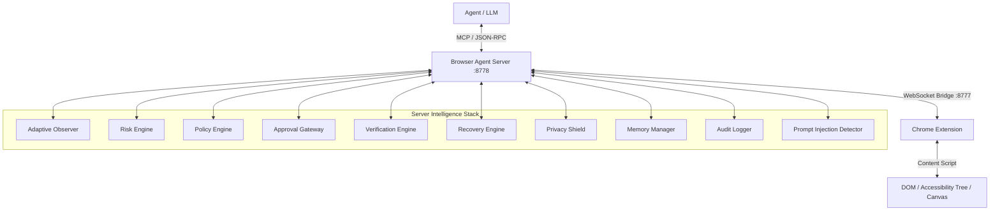

# Trustworthy Autonomous Browser Agent — Technical Architecture Specification

## Executive Summary
The **Trustworthy Autonomous Browser Agent** transforms raw web automation into a reliable, enterprise-grade, human-aligned AI assistant. It couples a lightweight Chrome Extension bridge with server-side modular intelligence engines to guarantee **safety, privacy, verifiability, and self-healing resilience**.

---

## 1. System Architecture Diagram

---

## 2. Core Module Specifications

### 2.1 Adaptive Observation Engine (`agent/src/observation/adaptive.ts`)
Dynamic selection of browser observation modes based on task context and page complexity:
- **`STATE`**: Flat interactive element array (fastest, lightweight).
- **`GRAPH`**: Accessibility tree projection with semantic role hierarchy.
- **`GRAPH_DELTA`**: Incremental DOM mutations since last action (token efficient).
- **`VISUAL`**: Tab screenshot capture via `chrome.tabs.captureVisibleTab`.
- **`HYBRID`**: Semantic graph + visual screenshot fusion.

### 2.2 Risk Engine (`agent/src/risk/engine.ts`)
Multi-factor risk assessment classifying every action into four levels:
- **`LOW`**: Read-only actions (scroll, read, navigate on low-risk sites).
- **`MEDIUM`**: Non-destructive form input, state mutations.
- **`HIGH`**: Destructive actions, administrative changes, code execution (`EVAL`). Requires human approval.
- **`CRITICAL`**: Password/credential input, financial transactions, mass deletion. Requires explicit human approval.

### 2.3 Policy Engine (`agent/src/policy/engine.ts`)
Configurable runtime rules governing domain trust and action permissions:
- Whitelisting / Blacklisting domain controls.
- Category-level thresholds (`autoAllowMaxRisk`).
- Domain-specific policy definitions (e.g., require approval for all actions on `*.bank.com`).

### 2.4 Human Approval Gateway (`agent/src/approval/gateway.ts`)
Asynchronous approval management for high-risk actions:
- Suspends agent execution until explicit human confirmation (`APPROVED` / `REJECTED`).
- Real-time notification and interaction via Web Dashboard (`http://localhost:8778/dashboard`).

### 2.5 Verification Engine (`agent/src/verification/engine.ts`)
Post-action validation comparing pre- and post-action state snapshots:
- Multi-signal detection: URL changes, title mutations, DOM count deltas, graph mutations, confirmation/error message detection.
- Returns status (`VERIFIED_SUCCESS`, `VERIFIED_FAILURE`, `UNCERTAIN`) with confidence scores.

### 2.6 Self-Healing Recovery Engine (`agent/src/recovery/engine.ts`)
Automated recovery from execution failures:
- Classifies failures (`ELEMENT_NOT_FOUND`, `STALE_ELEMENT`, `PAGE_CHANGED`, `TIMEOUT`).
- Applies bounded recovery strategies (`RE_OBSERVE`, `SEMANTIC_MATCH`, `WAIT_AND_RETRY`, `SCROLL_AND_FIND`).

### 2.7 Privacy Shield (`agent/src/privacy/shield.ts`)
On-the-fly detection and redaction of sensitive data:
- Protects Credit Cards, SSNs, Passwords, API Keys, Bearer Tokens, CVVs, Passwords, Emails, and Phone numbers.
- Replaces matches with `[REDACTED]` before sending data to LLMs or audit logs.

### 2.8 Security & Prompt Injection Defense (`agent/src/security/injection.ts`)
Scans webpage content (untrusted input) for malicious prompt injection attempts:
- Detects instruction overrides, role reassignments, credential harvesting, financial transfers, and policy bypasses.
- Blocks or flags untrusted content to maintain system safety boundaries.

### 2.9 Memory Manager (`agent/src/memory/manager.ts`)
Session-scoped task tracking preventing cross-task data leakage:
- Maintains task goals, action history, entity tracking, notes, and task snapshots.

### 2.10 Audit Logger (`agent/src/audit/logger.ts`)
Structured, sanitized event logging for compliance and debugging:
- Tracks all actions, approvals, risk evaluations, and security alerts.

---

## 3. Web Dashboard (`GET /dashboard`)
Real-time monitoring interface hosted at `http://localhost:8778/dashboard`:
- Live extension connection indicator.
- Active task details and event counters.
- Interactive **Pending Approval Cards** with 1-click Approve/Reject buttons.
- Real-time streaming audit log.

---

## 5. End-to-End Task Controller (`agent/src/controller/runner.ts`)
The `TaskRunner` orchestrates the entire intelligence stack using a strict `ExecutionStateMachine`. It automatically sequences observation, decision routing, risk/policy evaluation, execution, verification, and recovery.

---

## 6. MCP Tools Registry

| Tool | Category | Purpose |
|------|----------|---------|
| `browser_create_task` | Task Controller | Initialize a new autonomous task |
| `browser_run_task_step` | Task Controller | Advance task state machine by one autonomous step |
| `browser_pause_task` | Task Controller | Suspend execution |
| `browser_resume_task` | Task Controller | Resume execution |
| `browser_cancel_task` | Task Controller | Abort task |
| `browser_get_task` | Task Controller | Retrieve current task record and step history |
| `browser_get_state` | Observation | Flat DOM interactive element inspection |
| `browser_get_graph` | Observation | Semantic tree projection |
| `browser_observe` | Observation | Adaptive multi-mode observation (STATE/GRAPH/DELTA/VISUAL/HYBRID) |
| `browser_screenshot` | Observation | Capture visible tab screenshot |
| `browser_click` | Action | Click element by index |
| `browser_type` | Action | Type text into element |
| `browser_scroll` | Action | Scroll page directionally |
| `browser_scroll_to` | Action | Scroll element into view |
| `browser_navigate` | Action | Navigate tab to URL |
| `browser_eval` | Action | Execute JavaScript snippet |
| `browser_select` | Action | Select option in select element |
| `browser_highlight` | Debug | Overlay element bounding boxes |
| `browser_assess_action` | Risk & Policy | Evaluate action risk and policy rules |
| `browser_request_approval` | Human-in-the-Loop | Request approval for high-risk action |
| `browser_resolve_approval` | Human-in-the-Loop | Resolve pending approval |
| `browser_verify_action` | Verification | Validate action outcome |
| `browser_recover_action` | Recovery | Attempt self-healing after failure |
| `browser_redact_data` | Privacy | Sanitize text or observation |
| `browser_scan_security` | Security | Scan webpage for prompt injections |
| `browser_get_task_state` | Memory | Retrieve task session snapshot |
| `browser_get_audit` | Audit | Query structured audit events |
| `browser_get_policy` | Policy | Retrieve active policy rules |
| `browser_set_policy` | Policy | Configure domain-specific policies |

---

## 7. Verification & Testing

- **Unit Test Suite**: `npm test` (`node test-unit.mjs`) — 100% passing tests for Risk, Policy, Privacy, Injection Defense, Verification, Recovery, Memory, and Audit.
- **Real-Browser Validation**: `npm run validate` (in `bench/`) — Verifies the closed-loop state machine execution across all integration scenarios against a real local Chromium browser using Playwright, testing the live Extension/Bridge/Agent linkage.
- **End-to-End Integration Suite**: `node test-e2e-all.mjs` — Offline tests for deterministic evaluation of the TaskRunner.
